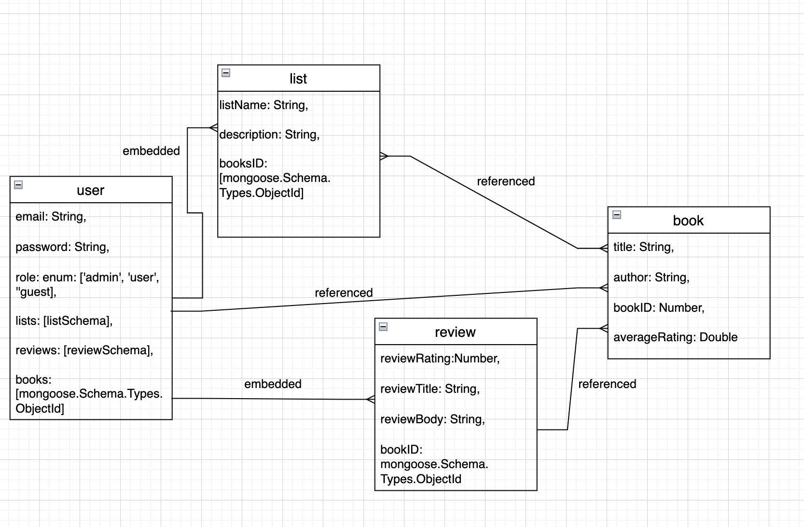

<h1 align="center">Book Logging Project</h1>

#### Date: 01/08/2024
#### By: Zainab Mohamed Dhaif

#### [GitHub](https://github.com/zainabdhaif) | [LinkedIn](https://www.linkedin.com/in/zainab-d-01665a27b/overlay/about-this-profile/?lipi=urn%3Ali%3Apage%3Ad_flagship3_profile_view_base%3BtZsWWAGJRcubFvRgNWnzZw%3D%3D) 

<h2 align="center">Description</h2>

This is a book logging website that aims to help users log and track their reading habits.

***

<b>User Stories</b>

1. AAU, I want to be able to create an account and log back into it whenever I wish to.

2. AAU, I want to be able to create different lists based on my preferneces.

3. AAU, I want to be able to add different books to my various lists.

4. AAU, I want to be able to add ratings and reviews to the books I read.

5. AAU, I want to be able to add new books to the website (this is for admin users only).

6. AAU, I want to able to add, edit, and delete editions of existing books to the website (this is for admin users only).

<b>Technologies Used</b>

* HTML
* CSS
* JavaScript
* Node.js
* Ejs
* Express
* Npm
* MongoDB

<h2 align="center">Getting Started</h2>

##### The project itself was deployed and can be viewed [here](https://book-logging-project-16f9d8f92c77.herokuapp.com/).

<h2 align="center">Screenshots</h2>

<b>ERD</b>

The ERD  

<b>Landing Page</b>

The landing page

### ***Future Updates***

- [  ] Allow users to add reviews to each page.
- [  ] Have better, more consistent styling.
- [ ] Allow users to see other users in the app and their reviews.